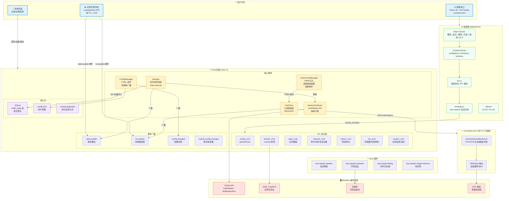
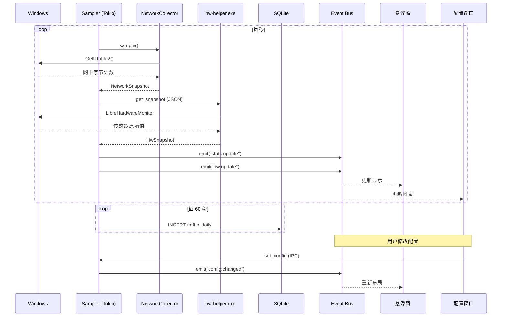
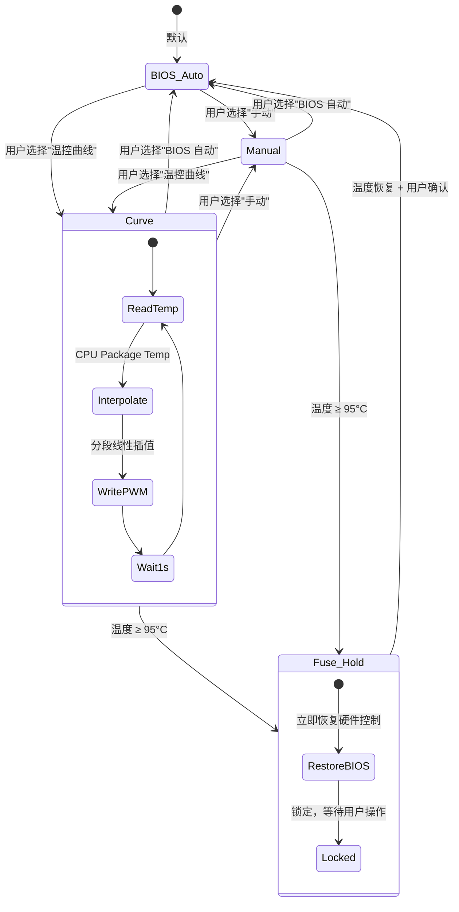

# SysPulse

一款 Windows 桌面端轻量级系统监控工具，通过任务栏悬浮窗实时显示网速、CPU、内存、温度、风扇等硬件状态，同时提供完整的配置界面和流量统计功能。

---

## 功能特性

### 任务栏悬浮窗
- 贴合 Windows 任务栏通知区域，模拟经典 DeskBand 体验
- 实时显示：网速（上行/下行）、CPU 占用、CPU 温度、CPU 频率、内存占用、GPU 温度/占用、硬盘读写、风扇转速、主板温度
- 显示项可自由选择和排序
- 背景透明度可调
- 右键菜单快速操作（设置、重新贴合、退出）
- 双击打开配置窗口

### 概览仪表盘
- CPU / 内存 / 网速 / 显卡 / 硬盘五大指标卡片
- 实时 60 秒折线图，支持多系列（网速、CPU 温度、GPU 温度、内存）
- 双 Y 轴刻度（左侧网速、右侧温度/百分比）
- 悬停查看精确数值

### 硬件监控
- CPU：包温度、频率、功耗、总占用率、每核心占用率+温度（进度条可视化）
- GPU：占用率、温度、显存使用进度条、功耗、风扇转速
- 内存：使用率进度条、频率、通道数、每条内存详情（插槽/容量/速度/厂商）
- 硬盘：型号、总线类型、温度、健康状态、容量使用进度条
- 主板：型号、Super I/O、温度传感器（彩色标签）、电压传感器
- 风扇控制：BIOS 自动 / 温控曲线 / 手动 PWM 三种模式

### 风扇温控曲线
- 8 点分段线性插值
- ≤40°C 静音保护（20% PWM 最低转速）
- 40~85°C 平滑爬升
- ≥85°C 全速保护
- 后端每秒计算，自动插值

### 流量历史
- 按日/按月统计上行下行流量
- 日期范围查询
- 导出 CSV
- 每页 10 条分页，最新日期在前

### 悬浮窗设置
- 显示项选择（药丸式 chip 交互）
- 拖拽排序（网格布局，每行 6 个）
- 背景透明度滑块

### 通用设置
- 开机自启动（Windows 注册表）
- 采样间隔调节（250ms ~ 10000ms）

### 自动更新
- 一键检查新版本
- 下载进度条
- 自动安装，重启生效

### 系统托盘
- 左键单击：切换悬浮窗显隐
- 左键双击：打开设置窗口
- 右键菜单：显示设置 / 显示悬浮窗 / 退出

---

## 架构图



### 数据流



### 风扇控制流程



---

## 技术栈

| 层 | 技术 | 说明 |
| :-- | :-- | :-- |
| 桌面框架 | **Tauri 2** | Rust 后端 + 系统 WebView2 前端，体积小、性能高 |
| 后端语言 | **Rust** | 内存安全、高性能系统编程 |
| 前端框架 | **React 18** | 配置窗口 UI |
| 类型系统 | **TypeScript** | 前端全量类型覆盖 |
| UI 组件库 | **Ant Design 5** | 企业级 React 组件 |
| 状态管理 | **Zustand** | 轻量级 React 状态管理 |
| 构建工具 | **Vite 5** | 极速 HMR 开发体验 |
| 国际化 | **i18next** | 中英文双语支持 |
| 数据库 | **SQLite**（rusqlite） | 本地流量历史持久化 |
| IPC 类型生成 | **tauri-specta** | Rust → TypeScript 类型自动生成 |
| 硬件传感器 | **LibreHardwareMonitorLib**（.NET 8） | CPU/GPU/主板/硬盘/风扇传感器读取 |
| 网络监控 | **Windows GetIfTable2 API** | 原生网卡流量采集 |
| 自动更新 | **tauri-plugin-updater** | 应用内检查+下载+安装 |
| 开机自启 | **tauri-plugin-autostart** | Windows 注册表自启动 |
| 日志 | **tracing + tracing-appender** | 结构化日志 + 按日滚动文件 |
| 并发 | **Tokio** | 异步运行时 |
| 配置 | **TOML** | 人类可读配置文件 |

---

## 项目结构

```
SysPulse/
├── src/                    React 配置窗口
│   ├── routes/             页面组件（概览/显示/硬件/历史/通用/关于）
│   ├── components/         通用组件 + 硬件面板
│   ├── stores/             Zustand 状态管理
│   ├── ipc.ts              IPC 调用封装
│   ├── bindings.ts         tauri-specta 自动生成的类型
│   └── i18n/               中英文翻译
├── overlay/                悬浮窗（纯 HTML/CSS/TS，无框架）
│   ├── index.html
│   ├── overlay.ts
│   └── overlay.css
├── src-tauri/              Rust 后端
│   ├── src/
│   │   ├── app.rs          应用初始化 + 窗口管理
│   │   ├── lib.rs          Tauri Builder 配置
│   │   ├── monitor/        采集器（CPU/Memory/Network）
│   │   ├── config/         TOML 配置管理 + 热更新广播
│   │   ├── storage/        SQLite 流量持久化
│   │   ├── ipc/            IPC 命令 + 事件
│   │   ├── hw/             硬件传感器客户端 + 风扇控制
│   │   ├── tray.rs         系统托盘
│   │   ├── sampler.rs      定时采样调度
│   │   └── windows_api/    Win32 API 封装
│   ├── icons/              应用图标（多尺寸 PNG + ICO）
│   └── tauri.conf.json     Tauri 配置
├── hw-helper/              .NET 8 硬件采集子进程
│   ├── HwSnapshot.cs       传感器数据模型
│   ├── FanControl.cs       风扇 PWM 控制
│   └── ComputerHost.cs     LibreHardwareMonitor 封装
├── scripts/                构建辅助脚本
├── package.json
└── README.md
```

---

## 系统要求

| 项 | 要求 |
| :-- | :-- |
| 操作系统 | Windows 10 1809+ / Windows 11 |
| WebView2 | 通常系统自带，安装包会自动引导 |
| Node.js | ≥ 20（开发） |
| Rust | stable ≥ 1.78（开发） |
| MSVC Build Tools | VS 2022「C++ 桌面开发」工作负载（开发） |
| .NET 8 SDK | 编译 hw-helper 需要（开发） |
| 管理员权限 | 硬件传感器读取和风扇控制需要 |

---

## 快速开始

```bash
# 安装前端依赖
npm install

# 编译硬件采集 helper（首次 + 修改 hw-helper/ 后）
npm run build:helper

# 启动开发模式（管理员权限下运行以获取完整传感器数据）
npm run tauri:dev

# 或使用辅助脚本（自动 UAC 提权）
python run-dev-admin.py
```

首次编译 Rust 依赖约 5-10 分钟，之后增量编译几秒。

---

## 打包发布

```bash
npm run tauri:build
```

产物：
- `src-tauri/target/release/bundle/msi/*.msi` — MSI 安装包
- `src-tauri/target/release/bundle/nsis/*.exe` — NSIS 安装包

---

## 热重载

| 修改内容 | 行为 |
| :-- | :-- |
| `src/**/*.tsx`（React） | 自动热重载 |
| `overlay/**/*`（悬浮窗） | 自动热重载 |
| `src-tauri/**/*.rs`（Rust） | 自动重新编译 + 重启 |
| `tauri.conf.json` / `Cargo.toml` | 需手动重启 |

---

## 配置文件

| 文件 | 路径 |
| :-- | :-- |
| 配置 | `%APPDATA%\SysPulse\config.toml` |
| 日志 | `%LOCALAPPDATA%\SysPulse\logs\app-YYYY-MM-DD.log` |
| 数据库 | `%APPDATA%\SysPulse\traffic.db` |

---

## 调试

```bash
# 调高日志级别
set RUST_LOG=debug,wry=info,tao=info
npm run tauri:dev
```

配置窗口或悬浮窗内按 **F12** 打开 DevTools。

---

## 自动更新配置

1. 生成签名密钥：`npx tauri signer generate -w ~/.tauri/myapp.key`
2. 将公钥填入 `tauri.conf.json` → `plugins.updater.pubkey`
3. 将 `endpoints` URL 改为实际发布地址（如 GitHub Releases）
4. 构建时设置环境变量 `TAURI_SIGNING_PRIVATE_KEY`
5. 发布时上传 `latest.json` 到 endpoint

---

## License

MIT
