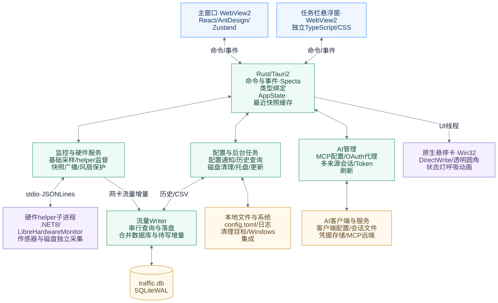

# SysPulse

Windows 桌面系统监控工具，使用 Rust / Tauri 2、React 19、TypeScript 和 .NET 8。提供任务栏悬浮窗、硬件监控、实时流量历史、磁盘清理，以及本地 AI 客户端管理。

## 功能

- **悬浮窗与概览**：显示网速、CPU、GPU、内存、温度、硬盘读写和风扇转速；显示项可拖动排序，网速与硬盘读写成对排列，宽度随内容调整。透明窗口贴合任务栏；图表按实际采样时间展示数据。
- **自定义悬停卡**：使用 DirectWrite 绘制中文和数值，适配不同 DPI，提供透明平滑圆角和状态灯呼吸效果；面板不抢焦点，隐藏后停止动画。
- **硬件监控**：普通传感器与磁盘独立采集。区分未知值与 `0 RPM`，超过 5 秒标记延迟、超过 30 秒显示未知。
- **风扇控制**：提供固件自动、手动 PWM 和 CPU 温控曲线。只有确认转速与控制通道关联后才允许写入；CPU 温度缺失、过期、达到 90°C 或连续写入失败时触发保护并尝试恢复固件控制。看门狗周期为 2 秒。
- **磁盘清理**：检查用户目录、固定磁盘和开发工具缓存，支持自定义项目根。扫描、清理和进度独立于页面，切换页面后继续运行；删除前复核文件身份、时间、保留期及重解析点，跳过占用或变化的文件。
- **AI 管理**：管理 Kiro、Codex、Claude CLI 的 MCP 配置与 OAuth，启动时及每两小时静默扫描；按项目浏览全部来源会话，支持分页、导出及按来源能力删除 Kiro、Claude、Antigravity、Gemini 会话。包含本地 OAuth 代理、凭据加密和 Token 刷新。
- **流量历史**：按日/月查询，每秒刷新累计下行、上行和合计，包含尚未落盘的增量。日期均为空时查询全部现存历史，CSV 导出沿用查询范围；日期面板使用数字月份。
- **系统设置**：固定采样间隔为 500～5000 ms，自适应采样为 500～2000 ms。支持 Windows 计划任务自启、托盘操作和应用更新，自启状态在页面切换间保持同步。

传感器可用性和控制能力取决于硬件、驱动及权限。无法确认的数据与控制关联保持未知或只读。

## 架构



- **显示层**：主窗口使用 React、Ant Design 和 Zustand；任务栏悬浮窗使用独立 TypeScript / CSS 入口。原生悬停卡由 Rust UI 线程绘制。
- **Rust 主进程**：Tauri 命令和事件连接界面与应用服务；共享快照供首次读取与悬停展示，采样、清理和持久化独立于页面运行。
- **硬件子进程**：.NET helper 通过 stdio JSON Lines 与 Rust 通信，基于 LibreHardwareMonitor 采集；普通传感器、磁盘和 WMI 元数据分别处理。
- **数据与控制**：流量 Writer 串行处理增量、查询和事务落盘；Rust 负责配置、文件清理、AI 客户端适配和风扇保护。

调用链、模块入口、事件和生命周期见[架构文档](docs/architecture.md)。架构图提供 [Mermaid 源文件](docs/architecture.mmd)及可放大的 [SVG](docs/architecture.svg)。

## 开发环境

| 依赖 | 要求 |
| --- | --- |
| 系统 | Windows 10 1809+ / Windows 11，WebView2 Runtime |
| Node.js | 推荐 22.12+；Vite 也支持 20.19+ |
| Rust | stable MSVC 工具链；依赖约束见 [Cargo.toml](src-tauri/Cargo.toml) |
| C++ 工具链 | VS 2022 Build Tools 的“使用 C++ 的桌面开发”和 Windows SDK |
| .NET | .NET 8 SDK |
| PowerShell | 7（`pwsh.exe`），构建脚本与管理员启动脚本使用 |
| Python | 可选，仅管理员启动脚本使用 |

在仓库根目录执行以下 PowerShell 命令：

```powershell
npm ci
npm run tauri:dev
```

`tauri:dev` 在 helper 缺失或源码更新时编译它，再启动 Vite 和桌面程序。默认开发地址为 `http://localhost:6541`；设置 `TAURI_DEV_HOST` 时，独立 HMR 端口为 6542。需要完整硬件能力时，在管理员终端运行；也可以使用 `python run-dev-admin.py`，由脚本校验 PowerShell 7 后请求 UAC 提权。该脚本会结束它识别出的当前项目旧进程并重新启动开发环境，不会退回 Windows PowerShell 5。

仅调试前端时使用 `npm run dev`；普通浏览器的模拟 IPC 入口见[隔离界面验收](tests/ui/README.md)。

## 构建与打包

```powershell
# 前端类型检查和生产构建
npm run build

# 强制重新发布硬件 helper
npm run build:helper

# 发布 helper、构建前端和 Rust，并生成 NSIS 安装包
npm run tauri:build
```

正式更新包需要设置 `TAURI_SIGNING_PRIVATE_KEY`，并与 [tauri.conf.json](src-tauri/tauri.conf.json) 中的更新公钥匹配。仅验证桌面编译、不生成安装包时使用 `npm run tauri:build -- --no-bundle`。

本机 Rust/Tauri 编译缓存统一位于 `Z:\SysPulseBuildCache\target`，默认安装包位于其 `release\bundle\nsis\`；指定 Rust 目标时位于 `<目标>\release\bundle\nsis\`。两个 [Cargo](.cargo/config.toml) [配置入口](src-tauri/.cargo/config.toml)统一使用 UNC 路径 `\\192.168.4.1\win_data\SysPulseBuildCache\target`，使普通和管理员构建中的插件权限文件路径一致。UNC 路径保留 Windows 反斜杠，避免 MSVC 将 `//` 识别为链接选项。

其他机器没有该共享目录时，通过 `CARGO_TARGET_DIR` 指向可访问的编译目录；GitHub Actions 已覆盖为工作区 `target/`。此配置只控制 Rust/Tauri target，npm 依赖与 helper 的默认中间目录仍在项目内。Release 默认启用 LTO，可通过 Cargo 环境变量覆盖。

也可运行 `pwsh -NoProfile -ExecutionPolicy Bypass -File build.ps1`，使用交互菜单选择 LTO / 普通构建或清理构建缓存，并将安装包复制到 `release/`。脚本沿用 Tauri 的前端构建钩子，前端只编译一次。菜单中的版本输入会修改版本文件；需要变更版本时还应同步锁文件。

[GitHub Actions](.github/workflows/build.yml) 构建 x64 和 ARM64：推送 `v*` 标签时发布安装包、签名及 `latest.json`，手动触发时上传构建产物。helper 的架构必须与桌面目标一致，例如 ARM64 使用：

```powershell
pwsh -NoProfile -ExecutionPolicy Bypass -File scripts/build-helper.ps1 -Runtime win-arm64
npx tauri build --target aarch64-pc-windows-msvc --bundles nsis
```

## 测试与检查

全新检出后，先运行 `npm ci`、`npm run build:helper` 和 `npm run build`，准备依赖、打包资源和前端输出。

```powershell
# 前端行为回归、类型检查和构建
npm test
npm run build
npx --no-install tsc -p tests/ui/tsconfig.json

# Windows 管理员启动器回归（不实际提权或结束进程）
python -m unittest discover -s tests -p test_run_dev_admin.py -v

# Rust 单元测试与严格静态检查
cargo test --manifest-path src-tauri/Cargo.toml --locked --lib
cargo clippy --manifest-path src-tauri/Cargo.toml --locked --all-targets -- -D warnings
cargo fmt --manifest-path src-tauri/Cargo.toml --all --check

# 可选：临时合成目录的扫描基准，不扫描真实磁盘缓存
cargo test --manifest-path src-tauri/Cargo.toml --locked --lib scan_synthetic_benchmark -- --ignored --nocapture

# 硬件合成回归，不启动真实采集程序
# artifacts-path 隔离测试输出，避免与开发中的 helper 冲突
$cacheDir = (cargo metadata --manifest-path src-tauri/Cargo.toml --no-deps --format-version 1 | ConvertFrom-Json).target_directory
$validationDir = Join-Path $cacheDir "hw-validation"
dotnet build tests/hw-helper/HwHelper.Tests.csproj --artifacts-path $validationDir -p:SelfContained=false
dotnet (Join-Path $validationDir "bin/HwHelper.Tests/debug/HwHelper.Tests.dll")
```

前端测试覆盖状态恢复、请求去重、历史日期范围、清理任务跨页、会话导航、拖动排序和读数显示；Rust 回归覆盖流量查询与落盘一致性、文件删除边界、会话存储、OAuth、helper 生命周期及原生提示面板绘制。涉及删除的回归使用合成临时目录。硬件测试使用虚构设备和内存传感器，不查询 WMI、不加载驱动、不操作真实风扇。

[隔离界面验收](tests/ui/README.md) 使用真实组件与模拟 IPC。真实桌面 IPC、主板与驱动差异，以及同负载下的 CPU、内存和帧率表现需要单独验收。

## 项目结构

```text
SysPulse/
├── .cargo/config.toml      通过 UNC 统一 Cargo 输出到 Z 盘编译缓存
├── .github/workflows/      x64 / ARM64 构建与发布
├── index.html              配置窗口入口
├── src/
│   ├── routes/             页面和路由注册
│   ├── components/         组件与交互逻辑
│   ├── stores/             界面状态、事件订阅、任务状态和查询缓存
│   ├── utils/              公共工具；回归测试与源码就近放置
│   ├── ipc.ts              IPC 包装
│   └── bindings.ts         Rust 自动生成的类型与命令
├── overlay/                独立悬浮窗入口，纯 TypeScript / CSS
├── src-tauri/
│   ├── src/app.rs          服务初始化、共享快照与窗口生命周期
│   ├── src/sampler.rs      基础采样调度与流量增量
│   ├── src/ai/             MCP、OAuth 和多来源会话管理
│   ├── src/hw/             helper 通信、硬件采样和风扇保护
│   ├── src/monitor/        CPU、内存和网络采集
│   ├── src/ipc/            命令注册、清理服务和事件
│   ├── src/config/         配置读取、规范化和通知
│   ├── src/storage/        SQLite 流量持久化
│   ├── src/windows_api/    任务栏层级、Win32 接口和 DirectWrite 悬停卡
│   ├── icons/              打包图标和源图
│   └── tauri.conf.json     窗口、资源、安装包与更新配置
├── hw-helper/              .NET 硬件采集和控制程序
├── docs/                   长期架构说明、图源、SVG 与清理研究
├── scripts/                helper 构建与按需更新
├── public/                 侧栏和 favicon 共用图标
├── tests/hw-helper/         C# 合成回归
├── tests/ui/               浏览器模拟 IPC 入口与验收说明
├── build.ps1               交互式构建、缓存清理和安装包复制
└── run-dev-admin.py         可选的管理员开发启动入口
```

## 维护约定

Rust 库只公开应用启动与绑定导出入口。IPC 的生产注册和测试处理器共用 [命令清单](src-tauri/src/ipc/commands/mod.rs)。修改命令或数据类型后，在根目录重新生成绑定：

```powershell
cargo run --manifest-path src-tauri/Cargo.toml --locked --bin export_bindings
```

不要手工修改 `src/bindings.ts`。`package-lock.json` 与 `src-tauri/Cargo.lock` 保留在版本控制中；Tauri 版本读取 `package.json`，发布前同步 Cargo 包版本及相关锁文件。

`docs/` 保留可持续维护的说明、图源和研究资料。已完成的临时任务清单、现场进程号与一次性构建记录不作为项目文档长期保留；实现变化同步到 README 和架构说明。架构图的重绘命令见[图形维护说明](docs/architecture.md#架构图维护)。

`node_modules/`、`dist/`、Cargo 配置的 target 目录（本机为 `Z:\SysPulseBuildCache\target`）、`src-tauri/gen/`、`hw-helper/bin/`、`obj/`、`publish/` 和 `src-tauri/resources/hw-helper/` 都是生成物。后者是桌面运行和打包资源，不应在程序运行时删除。TypeScript 增量信息放在 `node_modules/.cache/`；`cargo clean` 跟随 Cargo 配置清理 Z 盘缓存，也可用 `--target-dir` 显式指定位置。

硬件库固定为 LibreHardwareMonitorLib **0.9.4**，升级时需复核两个适配点：

- `SnapshotBuilder.CorrectStorageRate` 修正该版本将 `Stopwatch` 计数按 `TimeSpan` ticks 换算的存储速率问题，避免升级后重复修正。
- `FanReadingFreshness` 在 NVIDIA 更新前清空精确 Sensor 类型的内存缓存，避免驱动读取失败后沿用旧值。该操作不写硬件控制；类型或属性不匹配时返回未知。`FanChannels.Resolve` 则由快照和控制写入共用，拒绝按相同索引猜测 RPM/PWM 关联。

上游依据：[存储采样](https://github.com/LibreHardwareMonitor/LibreHardwareMonitor/blob/v0.9.4/LibreHardwareMonitorLib/Hardware/Storage/AbstractStorage.cs)、[Sensor.Value](https://github.com/LibreHardwareMonitor/LibreHardwareMonitor/blob/v0.9.4/LibreHardwareMonitorLib/Hardware/Sensor.cs)、[NVIDIA 更新](https://github.com/LibreHardwareMonitor/LibreHardwareMonitor/blob/v0.9.4/LibreHardwareMonitorLib/Hardware/Gpu/NvidiaGpu.cs)、[主板通道标签](https://github.com/LibreHardwareMonitor/LibreHardwareMonitor/blob/v0.9.4/LibreHardwareMonitorLib/Hardware/Motherboard/SuperIOHardware.cs)。

## 数据位置与排查

| 内容 | 默认位置 |
| --- | --- |
| 配置 | `%APPDATA%\SysPulse\config.toml` |
| 流量数据库 | `%APPDATA%\SysPulse\traffic.db` |
| 日志 | `%LOCALAPPDATA%\SysPulse\logs\app.log.YYYY-MM-DD` |
| AI 管理数据 | `%LOCALAPPDATA%\SysPulse\ai-tools\` |
| 清理热点索引 | `%LOCALAPPDATA%\SysPulse\cleanup-hotspots-v1.json` |

提高开发日志级别：

```powershell
$env:RUST_LOG = 'debug,wry=info,tao=info'
npm run tauri:dev
```

通用页配置读取失败时，可展开并复制首次失败诊断，再点击“重新读取”。helper 按就绪状态开始采样，初始化超时和异常退出会记录到日志。排查时保留首条错误、发生时间与所用构建，避免仅根据后续界面空值判断根因。

使用网络编译缓存时，确保普通与管理员终端均能访问同一 UNC 目录；迁移缓存后若出现插件权限文件读取错误，应检查生成索引中的旧绝对路径。构建报无法覆盖 `syspulse.exe` 时，先正常退出正在运行的对应开发程序，再重建。

## 第三方与许可

项目自有代码采用 **MIT 许可证**。AI 管理模块包含采用 **CC-BY-NC-SA-4.0** 许可的第三方代码，相关许可与署名保留在 [AI 后端许可文件](src-tauri/src/ai/backend/LICENSE.KiroHub) 中。各部分代码按其适用许可证使用与分发。

硬件传感器使用 **LibreHardwareMonitorLib（MPL 2.0）**。第三方组件分别遵循其许可证。
